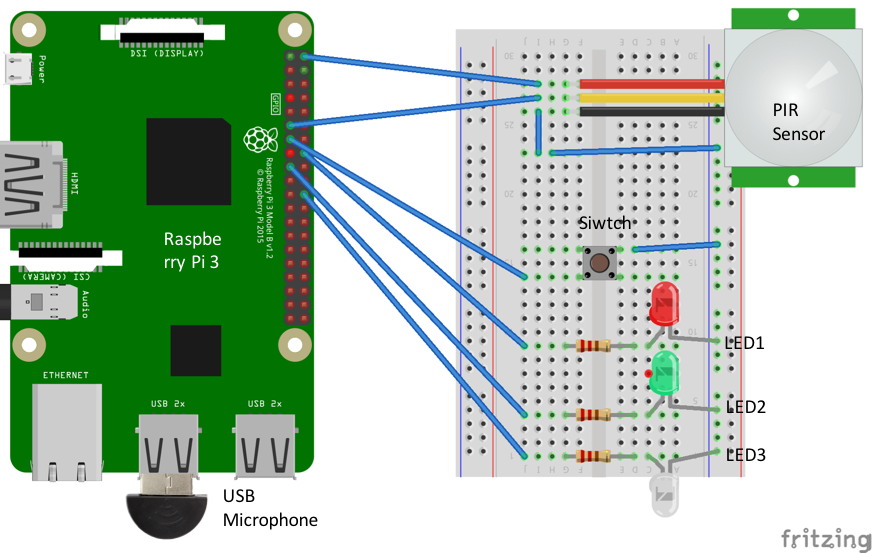
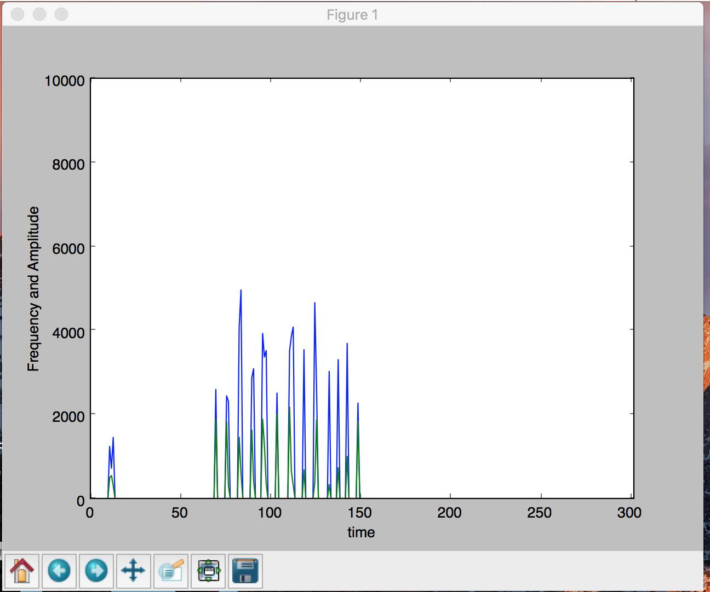
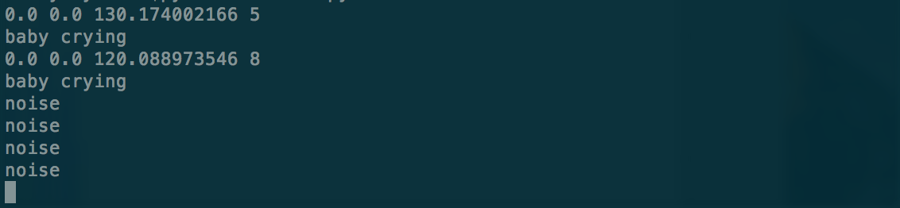

# Babycry Sound Processing
This babycry sound processing program is designed for raspberrypi, the aim is to detect both baby movement and baby cry sound at the same time, then notify the parents of the situation, this program is intented to be used in combination with [babycry webserver](https://github.com/ericzhangle/babycrywebserver), it checked user and device information at the start, record 10 seconds' ambient sound and send through server to the parents' cell phones, and recieve command from customer-side cell phone application (facebook messenger in this case).
## Introduction
The sound processing program is designed for raspberrypi, it requires hardware such as a usb microphone, LEDs, PIR sensor, and raspberrypi, it also requires the [babycry webserver](https://github.com/ericzhangle/babycrywebserver) to function properly. For more detailed overview of how this program is used in the whole picture, please reference the [project report](report).

## The hardware configuration of the baby detector
To use the full functions of this program(including the varies status of the detector, motion detection),hardware should be connected to raspberrypi as shown below .

If only the baby cry sound detecting function is required, it can be tested out on PC, you can jump to the section. 

## The functions of this web server:

**The fully functional baby detector running in raspberrypi:**

1. Show error status of the baby detector
   When the user is not registered in the webserver, or some internal error occurs in the detector, Red LED will be lit, indicating there's an error. If there's no wifi connection for the baby detector, the red LED will blink slowly, indicating the network error.

2. Show running and stopped status of the baby detector
   When Green LED of the baby detector is lit, we know the detector is running properly, if the greem LED slow-blinks, then it is stopped, either from remote control or stopped by  pressing the button.

3. Detect baby cry sound, LED indicator, sound record and send
   Baby cry sound is detected through finding the amplitude and the peaks of the frequency and calculating the average peak value of the frequency and how many peaks are detected, in addition to the average amplitude value of the sound, these criteria can be adjusted to detect other kind of sound (like plane, or some kind of bird), when a baby cry is detected, the white LED will blink, indicating the detection, and at the same time, the sound clip after the detection is recorded and uploaded to the web server where it is then forwarded to the parents for double confirm it is a true detection (and maybe sense the emergency level from the cry).

4. Motion detection.
   To further screen out possible false alert, we introduce a PIR sensor to detect the baby motion at the same time of cry detection, only when the baby cry and motion is detected at the same time can we be sure of the cry event and send the alert.

**The test program running on PC:**　　　
Detect baby cry sound and print the result on screen

## How to use
For using in raspberrypi:
1. Following packages need to be installed in raspberrypi.　　　
　`matplotlib`　　　
  `requests`　　　
  `pyaudio`　　　
  `numpy`　　　
  `Naked`
2. Hardware need to be connected as shown in the [hardware configuration](#the-hardware-configuration-of-the-baby-detector).
3. Copy the file:  `Raspberrypi/detect_peaks.py` to the python2.7's library folder of raspberrypi:  `***/lib/python2.7`
4. Copy  file `Raspberrypi/testForPi.py` to any folder of raspberrypi.
5. Run testForPi.py with python2.7 like:
`**/python2.7 testForPi.py`
For testing baby sound detection on PC.
6. Install  `Virtualenv` if you have not already done so.
7. Navigate to folder:  `babycry/bin`, and run command:
   `source activate`
8. Run following command to start the detecting process:
 `python2.7 test.py`
9. A window similar to the following will show indicating the frequency and amplitude of detected sound from the microphone of your PC.

10. On the terminal, messages similar to following will show indicating noise or detected baby cry.

   

